# Lucrarea de laborator nr. 2. Introducere în WordPress

## Scopul lucrării

Să înveți cum să instalezi WordPress într-un mediu local, să te familiarizezi cu panoul de administrare, să modifici aspectul site-ului prin teme și să extinzi funcționalitatea acestuia cu ajutorul plugin-urilor.

## Condiții

###  Pasul 1. Pregătirea mediului

1.Instalează XAMPP de pe linkul https://sourceforge.net/projects/xampp/

2.Pornește modulele Apache și MySQL. Asigură-te că http://localhost se deschide.

3.În phpMyAdmin, creează o bază de date nouă, de exemplu wp_lab2

### Pasul 2. Instalarea WordPress

1.Descarcă WordPress de pe wordpress.org

2.Dezarhivează fișierele în folderul htdocs

3.În browser, deschide http://localhost/wordpress și parcurge procesul de instalare introducand toate datele necesare 

Alegem limba instalarii

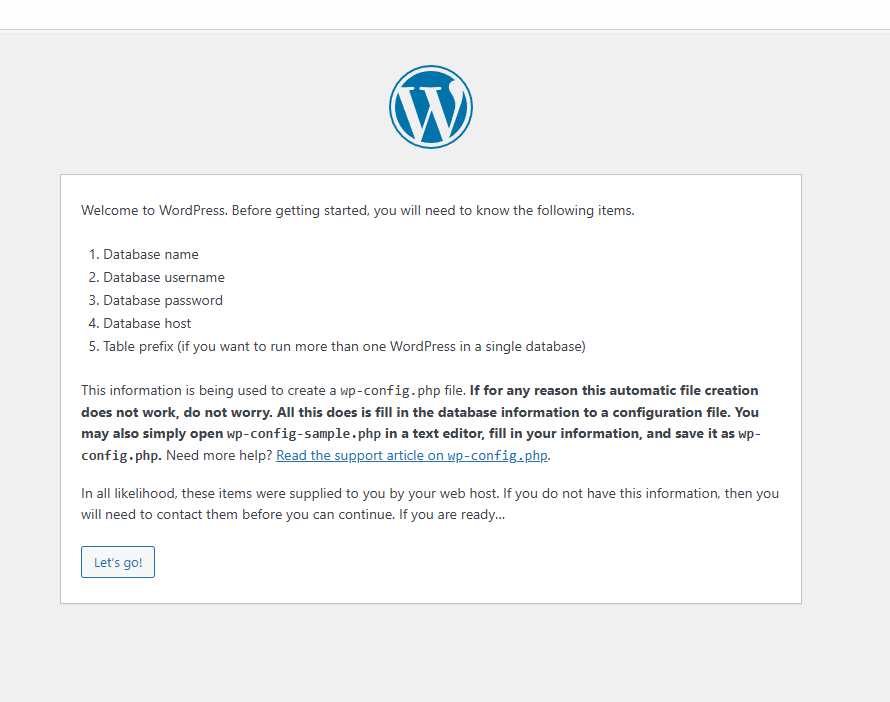

Introducem datele necesare

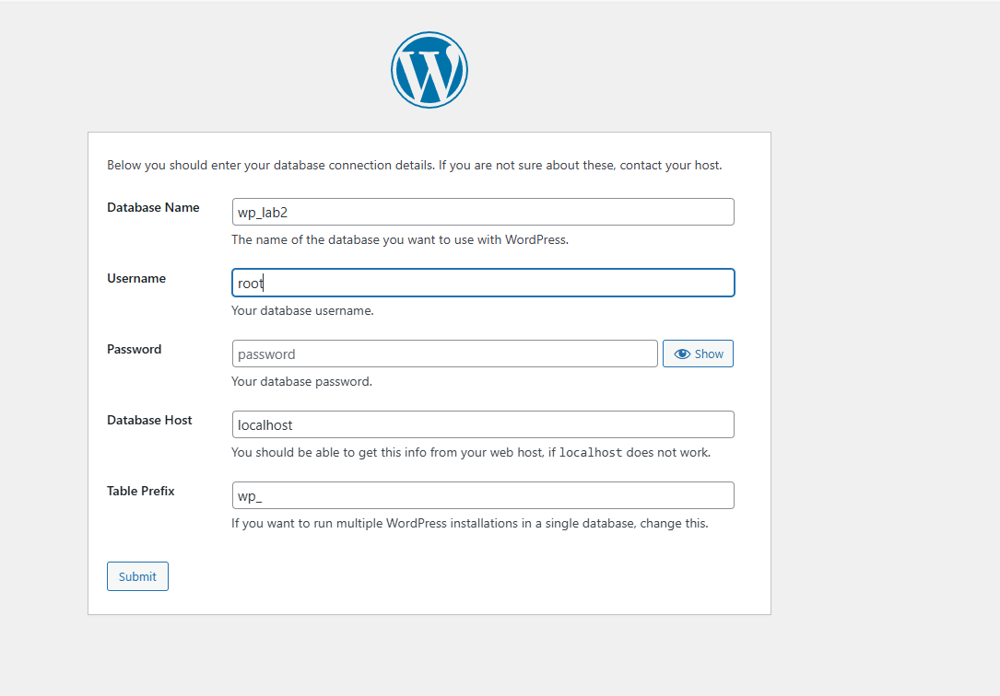

Pornim instalarea 

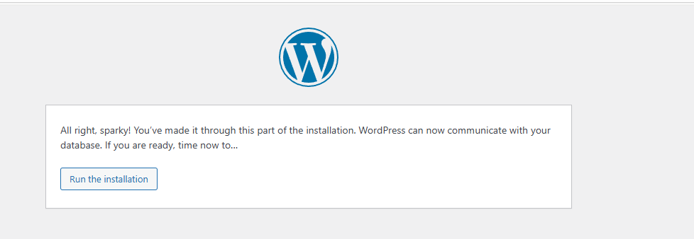

Alegem titlul si cream cont 

Ne logam si intram in pagina principala

### Pasul 3. Setările inițiale ale site-ului

1.În panoul de administrare, accesează secțiunea Settings → General. Schimbă numele site-ului și fusul orar.

2.În Settings → Permalinks, selectează opțiunea Post name pentru link-uri mai prietenoase.

### Pasul 4. Lucrul cu teme

1.Deschide secțiunea Appearance → Themes.

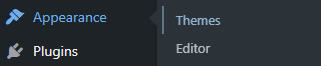

2.Instalează o temă nouă din catalogul oficial (de exemplu, „Astra”).

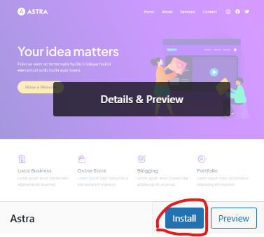

3.Activează tema și compară cum s-a schimbat aspectul site-ului.

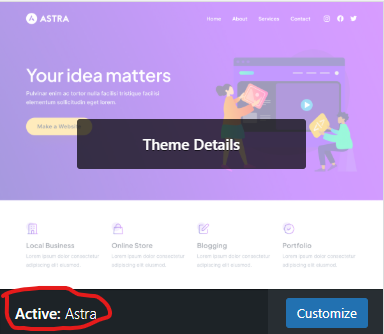

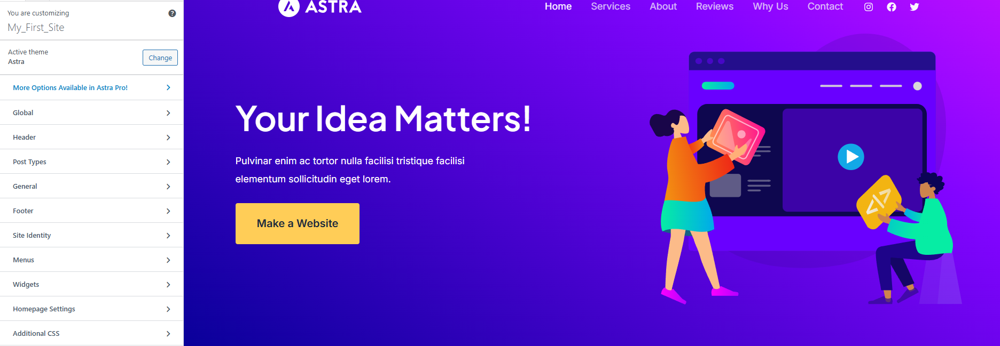

4.In meniul Appearance → Customize, configurează

4.1 logoul site-ului

4.2 schema de culori

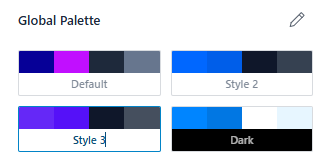

4.3 titlul și descrierea(In "Astra" poti doar titlu)

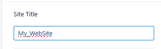

### Pasul 5. Lucrul cu plugin-uri

1. Accesează secțiunea Plugins → Add New.

2. Instalează și activează:

2.1 pluginul Classic Editor (pentru editorul clasic de postări);

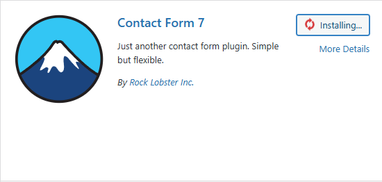

2.2 pluginul Contact Form 7 (pentru adăugarea unui formular de contact).

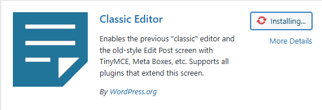

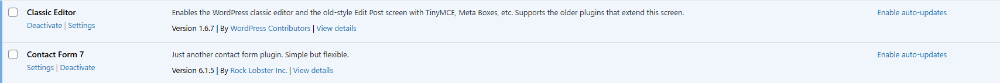

3.Verifică noile funcționalități în panoul de administrare (adăugarea unei postări cu Classic Editor și crearea unui formular cu Contact Form 7).

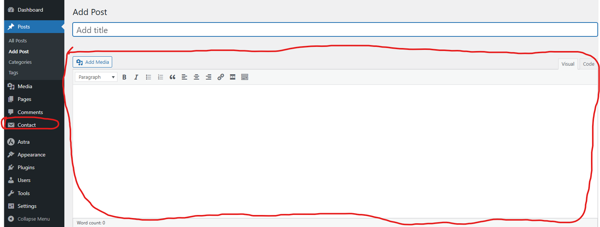

4.În Plugins → Installed Plugins, dezactivează unul dintre plugin-uri și asigură-te că funcționalitatea acestuia a dispărut.

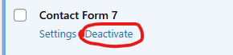

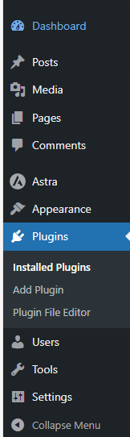

Observam ca a disparut Contact(ceea ce demonstreaza ca pluginul Contact form a fost deactivat)

### Pasul 6. Crearea de conținut

1.Creează o pagină simplă „Contacte” și inserează formularul de contact.

Accesam Contact->Contact Form si copiem continutul din Shortcode

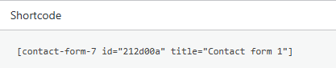

Accesam Pages->Add page si inseram codul copiat si publicam pagina

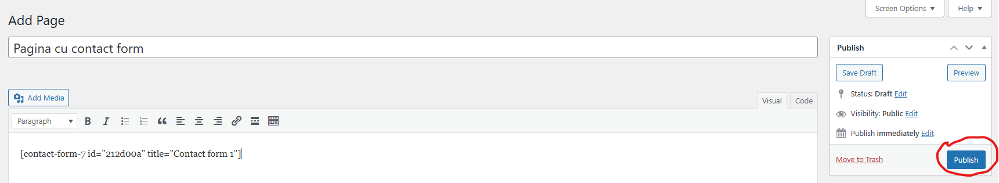

2.Creează câteva postări pe blog cu conținut diferit (text, imagini).

Accesam Pages->Add page si inseram imaginea si textul si publicam pagina

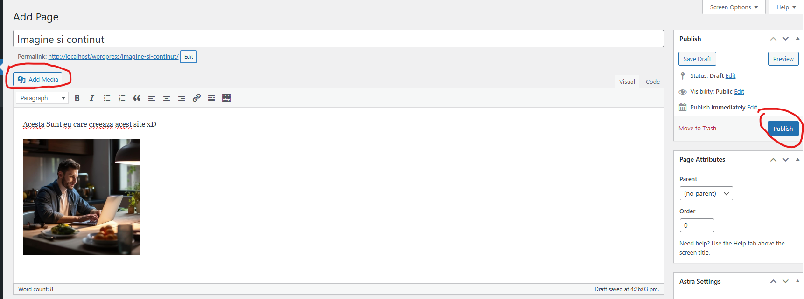

3.Verifică modul în care este afișat conținutul pe site.

Pages->All Pages->view(la pagina care dorim)

Pagina cu imagine si text

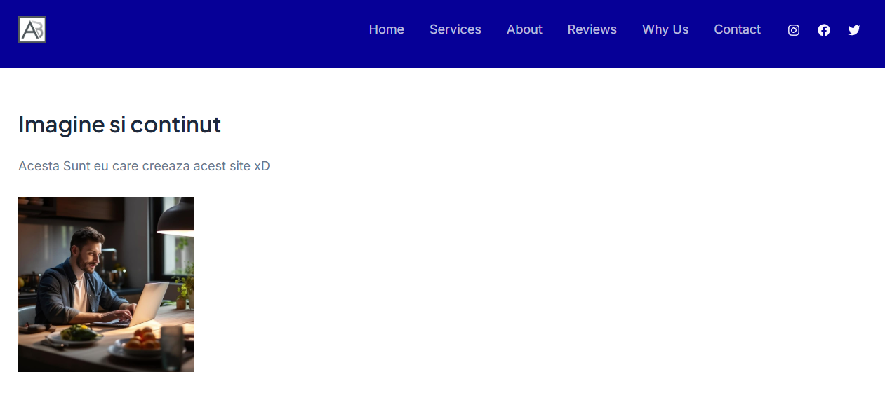

Pagina cu formularul

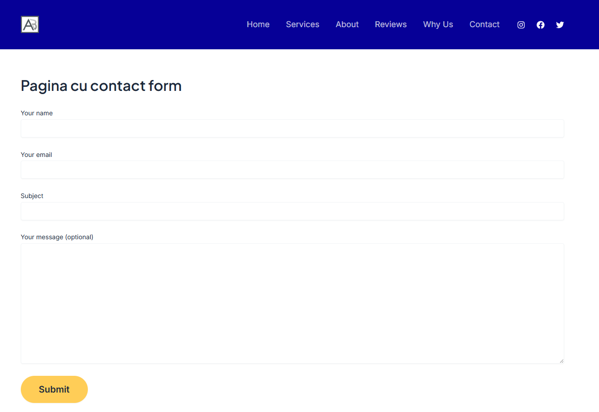

## Întrebări de control

1.Ce face o temă în WordPress și ce face un plugin?

Tema da culori siteului (ca un fel css) iar pluginul da functionalitati (ca JavaScript) 

2.De ce nu se pierde conținutul site-ului atunci când se schimbă tema?

Deoarece tot continutul se salveaza in baza de date.

3.Cum se poate modifica aspectul site-ului fără a edita codul?

Prin Customize (care il gasesti in acelasi meniu appearance ca si tema)
